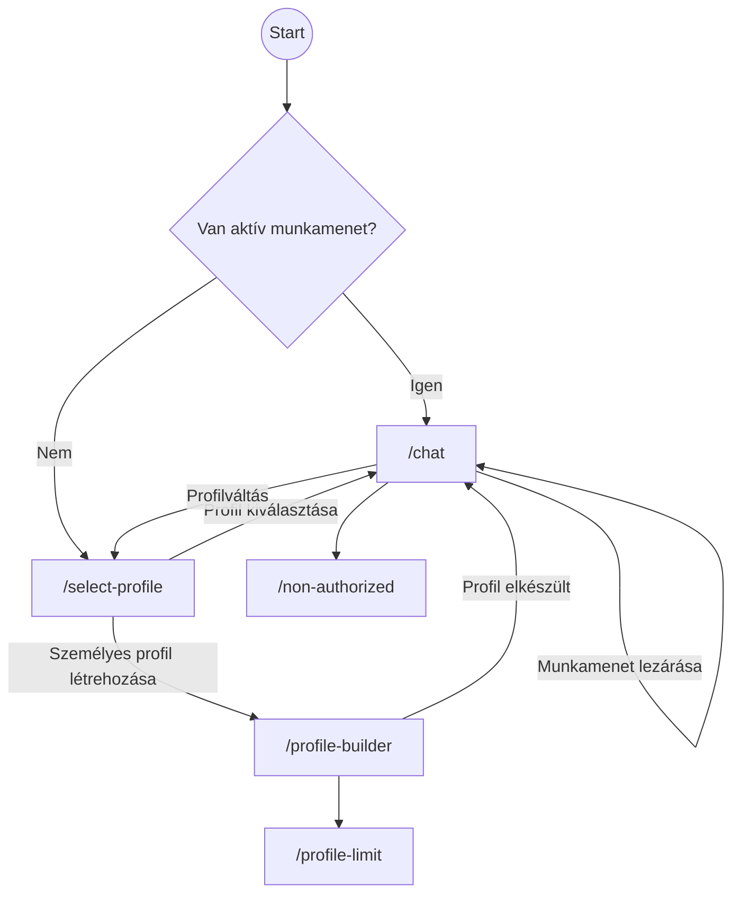

# Reflecta funkciótérkép és felhasználói útvonalak

Ez a dokumentum összefoglalja a frontend és backend által biztosított főbb nézeteket, funkciókat és azok közötti navigációt. A leírás a projekt `README.md`‑ben és a kódban található információkon alapul.

## Főbb oldalnézetek

| Oldal | Útvonal | Funkció | Backend kapcsolódások |
|-------|---------|---------|-----------------------|
| **Profilválasztó** | `/select-profile` | A felhasználó rendelkezésre álló naplóprofilok közül választhat. A `ProfileSlider` komponens jelenik meg. | `POST /api/profile-list` a profil adatokért; kiválasztáskor `POST /api/conversation/new` hívás történik. |
| **Chat felület** | `/chat` | A fő csevegőablak. Tartalmazza a beszélgetési listát, az üzenetküldő felületet, profilváltási lehetőséget és a memóriapanelt. | `POST /api/session` vagy `POST /api/conversation/new` (új beszélgetéshez), `POST /api/entries` üzenet mentéséhez, `POST /api/respond` válasz generálásához, `POST /api/session/close` záráshoz, `GET /api/memory/summary` memóriához. |
| **Profilépítő** | `/profile-builder` | Kérdőíves folyamat személyes profil létrehozására prémium vagy admin felhasználók számára. | `POST /api/profile-list` jogosultság ellenőrzéshez, `POST /api/profile/from-survey` a profil generálásához, majd `POST /api/conversation/new` indítja a beszélgetést. |
| **Profil limit** | `/profile-limit` | Jelzi, hogy csak egy személyes napló profil lehet. | – |
| **Nincs jogosultság** | `/non-authorized` | Egyszerű figyelmeztetés jogosultság hiányában. | – |

## Felhasználói útvonalak

1. **Belépés / inicializálás**
   - A `UserProvider` figyeli a WordPress beágyazást vagy az URL paramétereit (`user_id`, `email`, `token`).
   - Sikeres azonosítás után a felhasználó adatai a `sessionStorage`‑ba kerülnek.
   - Ha létezik aktív munkamenet (`/api/last-session`), a felhasználó automatikusan a `/chat` oldalra kerül.
   - Vendég belépés esetén automatikusan a `Reflecta` profil kerül hozzárendelésre, amelyet a `sessionStorage` `reflecta_profile` kulcsa tárol.
2. **Profil kiválasztása**
   - A `/select-profile` oldalon a `ProfileSlider` jelenik meg. A kártyák adatai `POST /api/profile-list` segítségével töltődnek be.
   - Egy profil kiválasztása `POST /api/conversation/new` hívást indít, ami létrehozza a beszélgetést és a munkamenetet, majd átirányítás történik a `/chat` oldalra.
   - Amennyiben a felhasználó rendelkezik személyes profillal, vagy prémium vagy admin jogosultsággal, megjelenik egy gomb a profilépítő indításához.
3. **Chat használata**
   - A `ChatPage` a `useUserSession` hookkal kéri le a profilhoz tartozó induló üzenetet (`POST /api/starting-prompt`) és létrehozza vagy visszatölti a munkamenetet (`POST /api/session`).
   - Üzenet elküldésekor `POST /api/entries` menti a bejegyzést, majd `POST /api/respond` generálja a választ.
   - A csevegés közben a felhasználó válthat másik profilra a bal oldali `ProfileSelectorSidebar` segítségével (új `POST /api/conversation/new` hívás és átirányítás).
   - A `ReflectiveMemoryPanel` a korábbi címkézett bejegyzéseket `GET /api/memory/summary` segítségével tölti be, melyek új beszélgetési téma indítására használhatók.
   - A munkamenet zárása a “Mára elég volt” gombbal (`POST /api/session/close`).
4. **Személyes profil létrehozása**
   - A prémium vagy admin felhasználók a profilépítő kérdőíven (öt kérdés) haladnak végig. A válaszok elküldése `POST /api/profile/from-survey` kérést indít.
   - Sikeres létrehozás után a rendszer felajánlja az új profilból indított beszélgetést (`POST /api/conversation/new`).

## Jogosultságok és Feature flag-ek

- A backend `auth.py` modulja szerepköröket kezel (`basic`, `premium`, `admin`).
- Bizonyos szolgáltatások csak magasabb szerepkörrel érhetők el:
  - **Személyes profil létrehozása** (`create_custom_profile`) prémium vagy admin felhasználóknak engedélyezett.

## Főbb komponensek és interakciók

- **ChatMessagesList** – megjeleníti az üzeneteket, kezeli a görgetést, a kezdő prompt kiválasztását és válasz finomítását (`ResponseTweakButtons`).
- **ChatFooter** – szövegbeviteli mező, “Küldés” gomb, valamint a záróüzenet indítására szolgáló animált gomb.
- **ProfileSelectorSidebar** – a beszélgetés közben elérhető profilok listája, innen indítható a profilváltás vagy a személyes profil létrehozása.
- **ReflectiveMemoryPanel** – a korábbi beszélgetések címkéit jeleníti meg, amelyekre kattintva újra rá lehet kérdezni egy témára.

## Navigációs áttekintés (Mermaid)

Ez az ábra a főbb felhasználói útvonalakat mutatja be. Az ábrán látható, hogy a bejelentkezést és esetleges munkamenet‑ellenőrzést követően a felhasználó vagy a profilválasztó oldalra, vagy rögtön a csevegésbe kerül. A csevegőfelületről lehetséges a profilváltás vagy egy már lezárt munkamenet újranyitása.

## Backend összefoglaló

- A `backend/app.py` modul állítja össze a FastAPI alkalmazást és regisztrálja az összes `/api` végpontot.
- Az egyes végpontok a Supabase adatbázissal kommunikálnak. Példák:
  - `POST /api/session` – új vagy meglévő munkamenet lekérése.
  - `POST /api/entries` – egy bejegyzés elmentése.
  - `POST /api/respond` – OpenAI hívással AI válasz generálása.
  - `POST /api/session/close` – a beszélgetés lezárása, címke létrehozása.
  - `GET /api/memory/summary` – korábbi bejegyzések összegzése címkék formájában.
  - `POST /api/profile/from-survey` – felhasználói kérdőív alapján új profil készítése.

A rendszer a `lib/api.ts` modulon keresztül kommunikál a fenti végpontokkal, amely a szükséges hitelesítési fejlécet is hozzáadja a kérésekhez.

---
Ez a dokumentum áttekintést ad a Reflecta alkalmazásban elérhető oldalakról, a felhasználói interakciókról, valamint a háttérben futó legfontosabb API-hívásokról.
